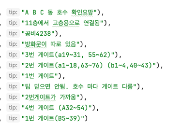
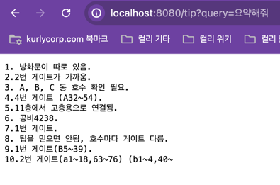

## 설명
배송팁에 대한 질의응답을 하는 API 서버 입니다.
등록된 데이터가 적어서(건물팁 10개, 말도 안되는 비정형화된 데이터) 대답을 잘하고 그러진 않습니다.
spring으로 간단한 ai를 만들어보는데 의의를 뒀습니다.
사용하고있는 데이터를 좀더 문장이 말이 되게, 좀더 많이,좀더 정형화 해서 등록하면 더 좋은 결과가 나올것 같습니다.



## 핸즈온

### 사전작업. gpt-4o 키 발급
https://platform.openai.com/api-keys 에서 발급받고 어딘가 메모해주세요. 
아래에서 gpt-4o api key를 환경변수로 등록해야 합니다.

> 개발하는동안 20~30번정도 호출해봤는데, 0.1$(200원) 정도 나온것같습니다.
몇번 사용해보는건 비용이 많이 들지는 않습니다.
> 발급이 번거로우시면 제꺼 빌려드릴게요


### 로컬에서 실행

해당코드 클론.

코드 내 docker-compose 실행 (vector db 실행)
```shell
docker-compose up -d
```

환경변수 추가
```shell
export SPRING_AI_OPENAI_APIKEY={발급받은 gpt-4o api key}
```

앱 실행
```shell
./gradlew bootRun
```

### 브라우저에 출력 테스트
#### 요청
```
http://localhost:8080/tip?query=전체를 요약해줘 
```

#### 결과
결과1.



결과2.


데이터도 부실하고 코드도 부실하지만 생각보다 결과가 잘 나오는것 같습니다.
다른 질문들 예시도 참고.
```
전체를 요약해줘
몇번게이트가 가까워?
공동현관 비번은?
공비?
4번게이트 위치 알려줘
고층 가려면 어떻게해?
```
